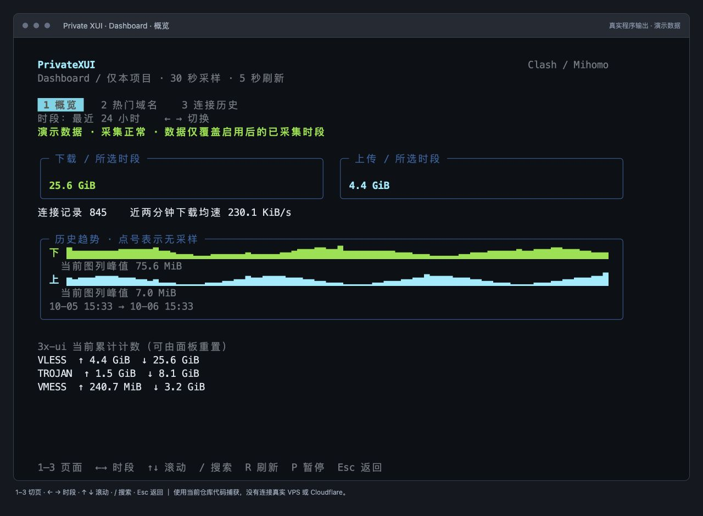
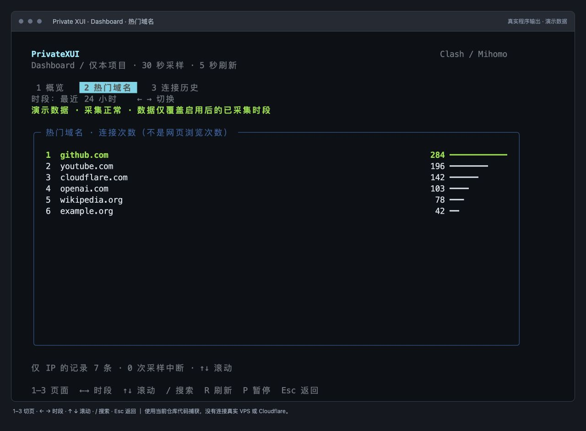

# TUI Dashboard：流量、历史和热门域名

Dashboard 在 **SSH 终端里**运行，不是网页，不创建网络监听端口，也不需要另设域名、访问令牌或 SSH 端口转发。

## 启用

先在 VPS 更新工具：

```bash
curl -fsSL https://raw.githubusercontent.com/isyundong/private-xui/main/install.sh -o private-xui.sh
bash private-xui.sh dashboard install
```

确认后启用后台采集。之后直接运行：

```bash
private-xui dashboard
```

也可在主菜单按 **D**，或进入 **维护 → Dashboard · 流量与历史**。第一次选择 **启用 / 更新采集**，之后选择 **打开 Dashboard**。

需要 Linux、systemd、Python 3.9+ 和本机 SQLite 版 3x-ui。新建访问日志时需要 logrotate；如缺失，按提示安装。无需 Cloudflare API Token，也不需要重新发布订阅 Worker。

## 终端操作

| 按键 | 操作 |
| --- | --- |
| 1 / 2 / 3 | 流量概览 / 热门域名 / 连接历史 |
| ← / → | 最近 24 小时 / 7 天 / 30 天 |
| ↑ / ↓ | 滚动域名和连接记录 |
| / | 按目标域名或 IP 搜索历史；清空后显示全部 |
| R | 立即刷新显示 |
| P | 暂停 / 恢复显示刷新 |
| Esc / Q | 返回；后台采集继续运行 |

终端最小 52 列 × 20 行；建议 100 列 × 30 行以上。宽终端显示更多图表和节点计数。

## 指标含义

- **所选时段上传/下载**：只读本项目入站的 3x-ui 计数，每 30 秒采样计算增量。首次采样仅建立基线，不把安装前的累计流量算成今天流量。
- **近期平均速率**：近两分钟已记录流量的平均值，不是瞬时网速。
- **趋势**：按时间聚合的字符图。点号表示没有采样，上传/下载各自缩放，不能直接用字符高度比较两者带宽。
- **节点当前累计计数**：3x-ui 的当前数值，面板重置后会变化。Dashboard 对一次观察到的计数重置计算新计数增量，但无法恢复两次采样之间丢失或多次清零的数据。
- **热门域名**：按访问日志中的连接记录数排名，包含接受和拒绝记录。不是网页浏览次数，也不代表该网站使用了最多流量。后台请求、自动测速和网页子资源都可能产生连接。
- **历史**：时间、目标域名/IP、端口、协议、接受/拒绝结果；只显示最近 100 条匹配记录。时间使用服务器本地时区。

没有访问日志或只看到 IP 时，不会猜测网站名称。HTTPS 内容、完整 URL、搜索词均不采集。多设备共用节点凭据时合并统计，不冒充设备级统计。

## 日志与保留

默认保留 30 天，详细连接最多 10 万条；首次安装可指定 `--retention-days 7`。数据在 `/var/lib/private-xui-dashboard/`，目录权限 700，文件仅 root 可读写。SQLite 设约 128 MiB 页数上限，达到上限或磁盘不足时显示采集异常；它不是无限日志仓库。

若已有 Xray 访问日志，直接复用，不修改其原有轮转策略。也可显式指定：

```bash
private-xui dashboard install --access-log /var/log/x-ui/access.log
```

若未启用日志，安装会说明并开启 Xray 全局访问日志，重启 x-ui，节点可能短暂断线。原始日志可能包含其他入站；Dashboard 仅将本项目标签的记录入库，并且不保存源 IP、客户端 email 或凭据。自己创建的日志每 5 分钟检查一次 10 MiB 轮转阈值，保留两份压缩旧日志。日志高峰期间可能暂时超过阈值。

复用旧文件时从文件末尾开始，不导入启用前的访问历史。重启保留读取位置；日志轮转/截断按新文件继续。copytruncate 以及异常停机可能丢失少量记录，这不是审计级无损日志系统。采样中断不把未知期间的流量强行补记到恢复时段。

## 管理

```bash
private-xui dashboard status       # 采集状态
private-xui dashboard install      # 更新/重启采集，保留已有配置和历史
private-xui dashboard uninstall    # 停止并卸载采集，保留历史
```

卸载只恢复 Dashboard 自己修改且仍未被用户改动的日志字段；不删除 3x-ui、代理节点或订阅。完整卸载 Private XUI 时，也会停止匹配本机状态文件的 Dashboard 采集，历史保留。状态目录和原始日志不会被静默删除。

排查使用：`journalctl -u private-xui-dashboard -n 50`。面板提示“采集失败”与“没有流量”是不同状态，请不要把空曲线当成零使用量。

所有展示与采集都在 VPS 本地完成，不调用第三方统计服务。当前版本的 SQLite、日志、安装恢复和 TUI 键盘/缩放通过本地测试；仍需在实际 VPS 验证 3x-ui 日志路径和 systemd 权限。

## 实际 TUI 截图

以下是当前 curses 程序的实际终端输出，使用演示数据，不是 VPS 实测记录。




