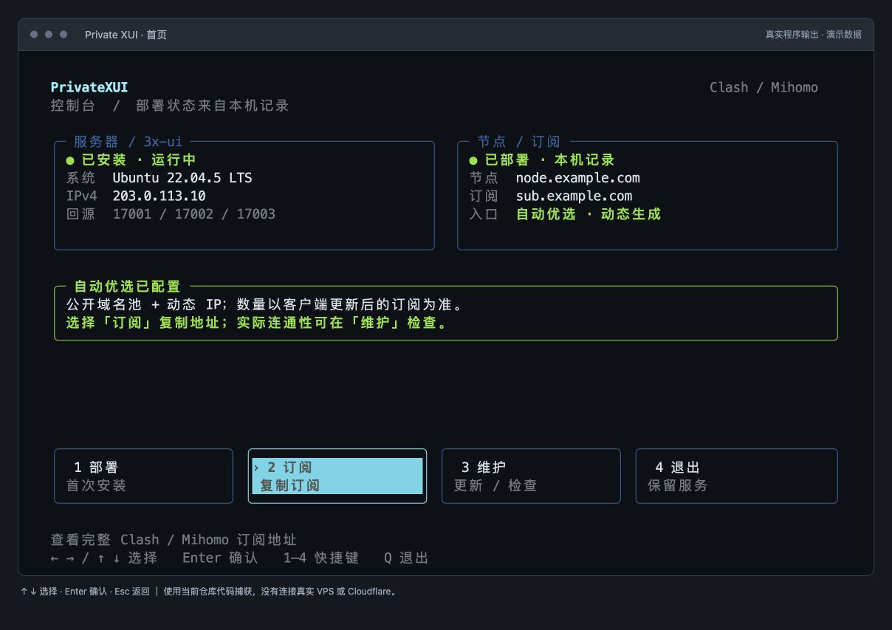
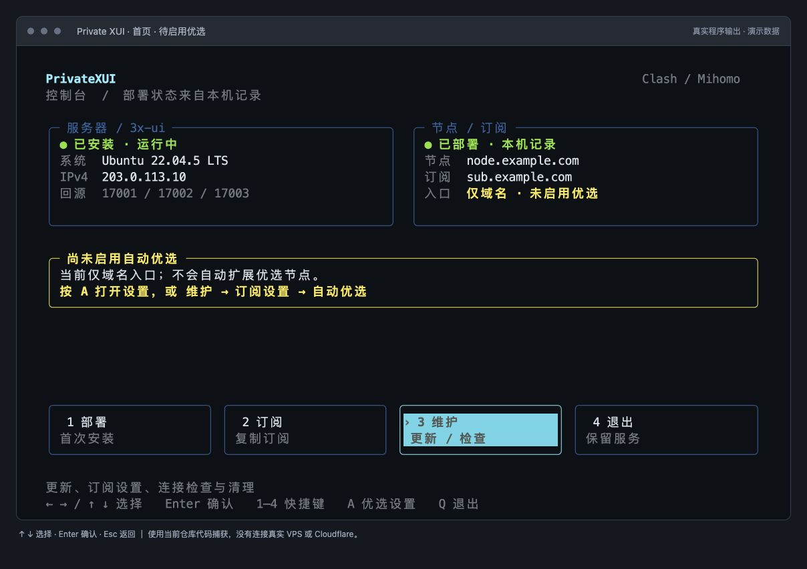
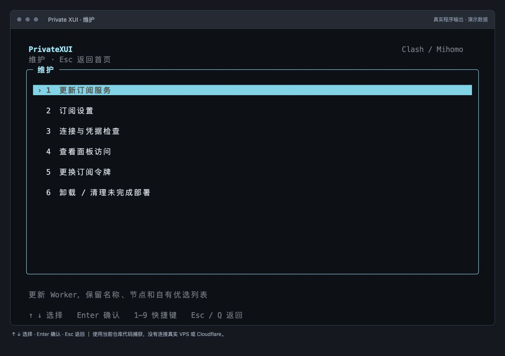

# 终端界面

以下截图使用当前程序的真实 curses 终端输出和演示数据，在隔离终端模拟器中渲染，不含真实订阅令牌。

## 正常首页

服务器与面板、节点与订阅分别显示。绿色表示相应状态正常；“已部署”依据本机记录，不代表实时检查云端资源。

## 尚未启用动态优选

旧版仅域名配置会明确显示黄色提示。按 **A** 进入自动优选设置，确认后更新 Worker；不会静默覆盖用户配置。

## 维护

维护操作收在二级页面，选中项高亮，下方显示用途。卸载和令牌轮换仍需要明确确认。

