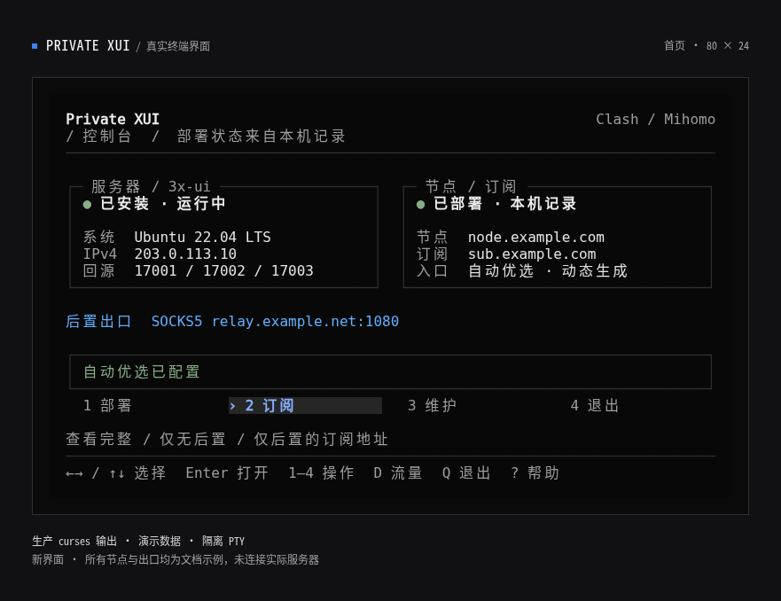
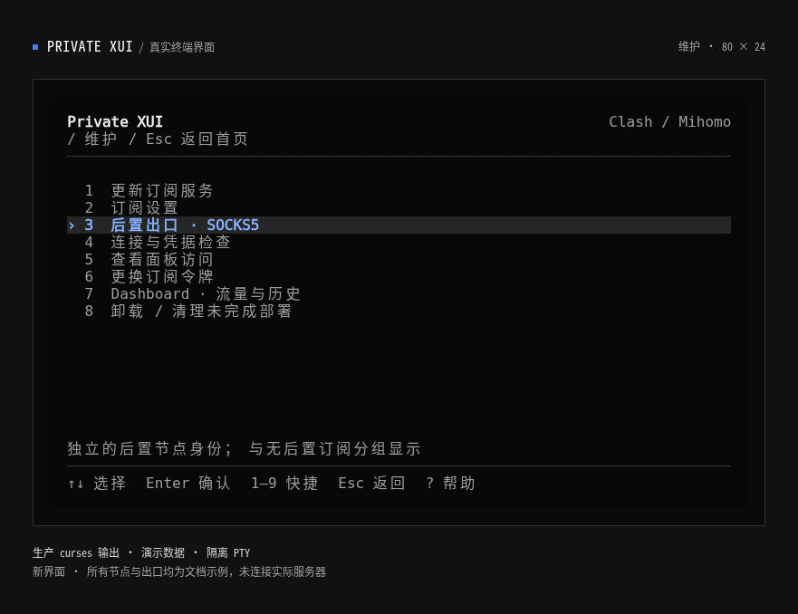
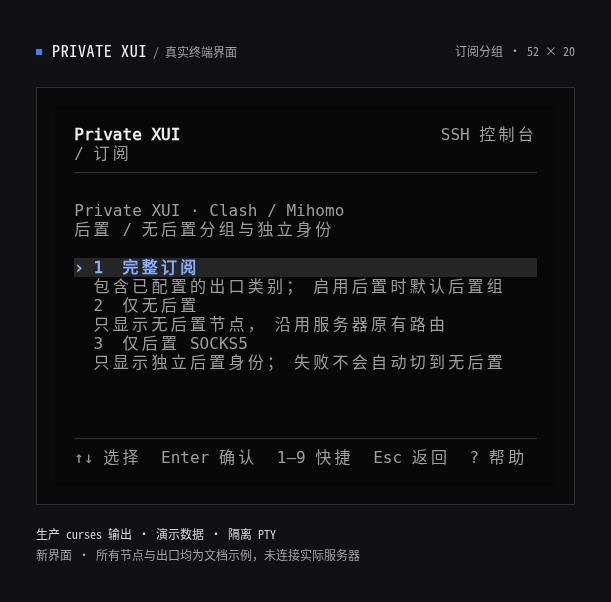
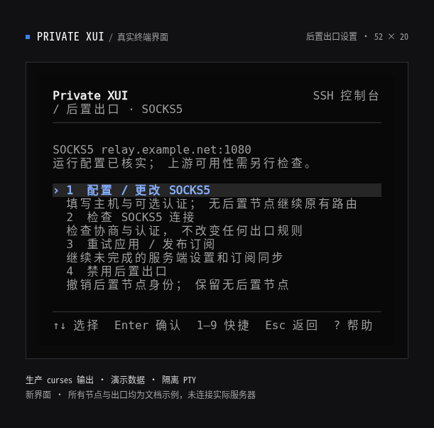
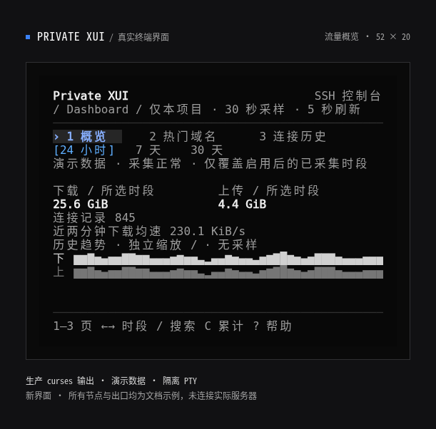

# 终端界面

以下截图使用当前生产 `tui.TerminalUI` 的真实 curses 输出和演示数据，在隔离终端模拟器中渲染，不含真实订阅令牌，也没有连接 VPS 或 Cloudflare。配色为 Neutral / Blue，直角细边框；无颜色终端仍保留反色与焦点标记。

## 正常首页

服务器与面板、节点与订阅分别显示。“已部署”依据本机记录，不代表实时检查云端资源；后置出口显示脱敏摘要。

## 维护

维护操作收在二级页面，选中项高亮，下方显示用途。卸载和令牌轮换仍需要明确确认。

## 订阅类别

完整、仅无后置、仅后置分别选择；显示地址前可以明确识别所需类别。完整订阅启用后置时默认选择后置组。

## 后置出口

配置、检查、重试与禁用分开呈现，首页和状态摘要不展示用户名或密码。

## 紧凑 Dashboard

最小 52×20 保留两条趋势与关键口径；`C` 可查看当前累计计数，`?` 查看说明。

旧版仅域名配置仍会显示待处理提示，按 **A** 进入自动优选设置，确认后才更新 Worker。最初的设计归档见 [设计审阅板](../design/tui-shadcn/index.html)。
